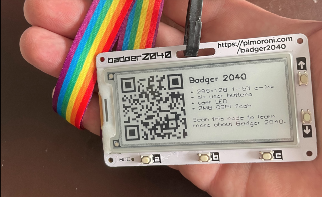

# tiny-badge



This repo holds the code of my messing about with [tinygo](https://tinygo.org/) and the [badger2040](https://learn.pimoroni.com/article/getting-started-with-badger-2040). Credit to [emmaly/tinygo-garden](https://github.com/emmaly/tinygo-garden/tree/main/badger2040/badge-with-shapes) for the example. Tinygo machine reference [here](https://tinygo.org/docs/reference/microcontrollers/badger2040/).


## Usage

tiny-badge provides three main screens. ID / Business Card. Bitcoin address. Project info.

The A, B, C buttons can be used to switch between screens. Later the UP / DOWN buttons may be used to update the screens.

Text and Images come from files on the badger2040 filesystem. You could use the examples from the fs directory or replace with your own. These should be copied to the root of the badger2040 in bootloader mode.


## Setup

```shell
wget https://github.com/tinygo-org/tinygo/releases/download/v0.28.1/tinygo_0.28.1_amd64.deb
sudo dpkg -i tinygo_0.28.1_amd64.deb
```


## Build or Flash

```shell
# Plug the badger2040 in while holding the USER button to get into bootloader mode
# This will build & flash
tinygo flash -target=badger2040 .

# This will build a binary file. Copy it to the badger2040 in bootloader mode that appears as a USB flash drive.
tinygo build -target=badger2040 -o badger2040_tinybadge.uf2 .
cp -v ./badger2040_tinybadge.uf2 /media/user/RPI-RP2
```

